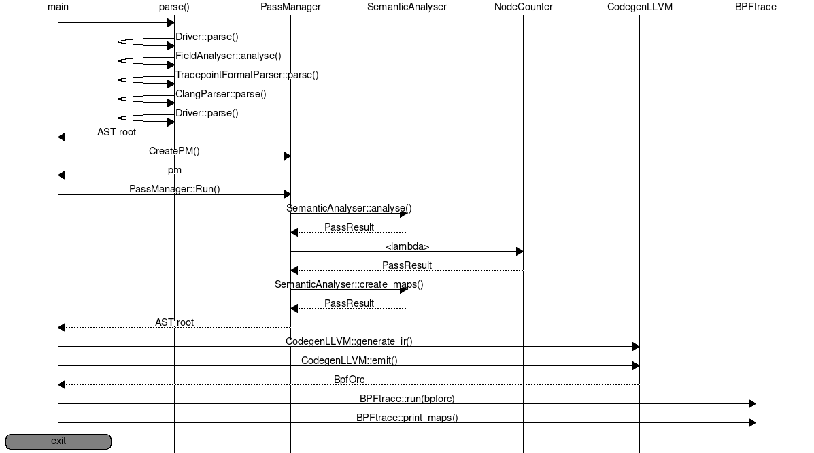
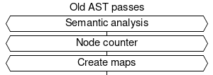
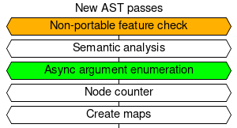
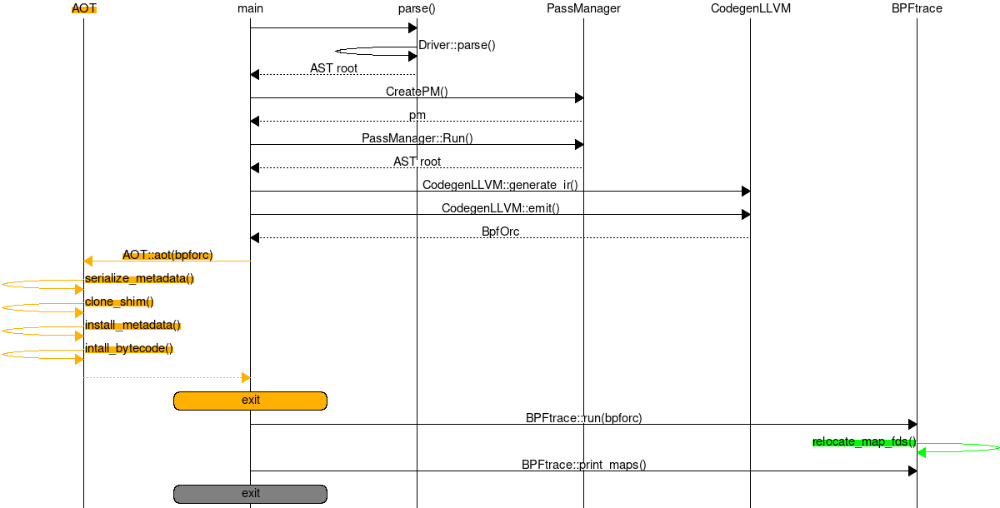
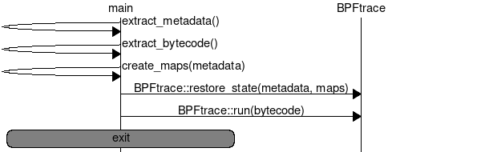

% Ahead-Of-Time compiled bpftrace programs

This page serves as a design document for bpftrace AOT compilation support.
Design is currently a work-in-progress and will be (somewhat) regularly updated.

## Overall design

* Ship a fully executable runtime shim with bpftrace
* When compiling a AOT bpftrace program:
  * Build the metadata
  * Build the bytecode
  * Make a copy of runtime shim and store metadata + bytecode into a special
    ELF section (this is the final executable)
* When the shim runs, it knows to look inside itself for the metadata + bytecode
  and start execution

## Current architecture

{ width=100% }

## Proposed architecture

AST passes:

=>

Simplified architecture (some unchanged parts omitted):

{ width=100% }

Key:

* Green -> added to all codepaths
* Orange -> added to AOT compile codepath

---

AOT execution:

## Unsolved problems

* `CodegenLLVM` relies on runtime state in `BPFtrace`
  * Async argument IDs (`printf_id_`, `cat_id_`, `etc`)
  * Codegen for `elapsed` embeds map FD
  * Positional parameters are hardcoded into bytecode
  * Any others?
* Some features rely on per-host properties
  * `kaddr()`
  * `uaddr()`
  * `cgroupid()`
  * Any `-p PID` based feature
    * watchpoints, certain USDT features
  * Any others?
* Generate CO-RE field access instructions
  * Will need to generate some kind of access identifier (eg. `1:0:3:4`)
* Runtime still use bcc (eg. symbolization) and bcc links LLVM

## Notes

* Can save metadata into special ELF section; fortunately we don't need to
  worry about compatability as an AOT executable is hermetic
* Must ship a stubbed (no bytecode) AOT executable that knows to look inside
  itself for bytecode
  * Should be simple enough with cmake
* Can create a ReadOnlyData abstraction that holds data that is only known
  at runtime but progs need to access too (`elapsed` builtin, positional params,
  etc.) and is backed by multiple maps (for different data types)
* Will need to relocate pseudo-map-FDs at runtime to FDs of created maps
  (see BPF_PSEUDO_MAP_FD in libbpf)
* Punting everything we can to libbpf seems like a prudent decision
  * Map creation, map FD fixup, extern symbol resolution
  * Reason is that some new bpf helpers (bpf_per_cpu_ptr()) require BTF ID to
    be in immediate operand of certain instructions, and we don't really want
    to redo/maintain that stuff in bpftrace
  * Another reason is that in the future we may want to link other BPF
    programs in (like DWARF-based stack walker)

## Future goals

* User can select features to enable in codegen
  * eg. "tell codegen that the target host has XXX feature"
* Emitted bytecode takes advantage of CO-RE to be more compatible on other
  hosts
