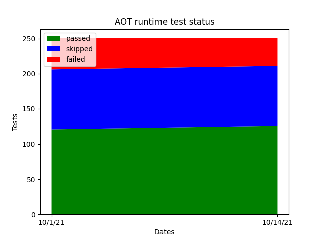

% Ahead-Of-Time compiled bpftrace programs

This page serves as a design document for bpftrace AOT compilation support.
Design is currently a work-in-progress and will be (somewhat) regularly updated.

## Background

* AOT is motivated by the following technical concerns:
  * Shipping/running LLVM onto prod hosts is resource-heavy (binary size,
    memory consumption)
  * Time to first trace is slow for dynamic bpftrace b/c we have to do all the
    AST passes AND setup runtime resources, where for AOT bpftrace we can just
    do runtime resource setup
  * Dynamically compiled bpftrace scripts cannot be easily signed

## Overall design

* Ship a fully executable runtime shim with bpftrace
* When compiling a AOT bpftrace program:
  * Build the metadata
  * Build the bytecode
  * Make a copy of runtime shim and store metadata + bytecode into a special
    ELF section (this is the final executable)
* When the shim runs, it knows to look inside itself for the metadata + bytecode
  and start execution

## Current architecture

{ width=100% }

## Proposed architecture

AST passes:

=>

Simplified architecture (some unchanged parts omitted):

{ width=100% }

Key:

* Green -> added to all codepaths
* Orange -> added to AOT compile codepath

---

AOT execution:

## Unsolved problems

* Create fully static aot-rt binary
* Generate CO-RE field access instructions
  * Will need to generate some kind of access identifier (eg. `1:0:3:4`)
* Runtime still use bcc (eg. symbolization) and bcc links LLVM
* Punt all loading to libbpf to gain access to CO-RE features?
  * Map creation, map FD fixup, extern symbol resolution
  * Reason is that some new bpf helpers (bpf_per_cpu_ptr()) require BTF ID to
    be in immediate operand of certain instructions, and we may not want
    to redo/maintain that stuff in bpftrace
  * Another reason is that in the future we may want to link other BPF
    programs in (like DWARF-based stack walker)
  * Reasons not to completely switch over to libbpf include:
    * Large amount of bpftrace code modifications
    * Loss of ability to mock out maps / unit testing
    * Extra overhead constructing ELF files for libbpf to work with
    * If there's ever a bug in libbpf or we need a new feature, we are beholden
      to distros shipping an updated libbpf. We cannot vendor either as it's
      not going to fly with the distros.

## Notes

* Can save metadata into special ELF section; fortunately we don't need to
  worry about compatability as an AOT executable is hermetic
* Must ship a stubbed (no bytecode) AOT executable that knows to look inside
  itself for bytecode
  * Should be simple enough with cmake
* Will need to relocate pseudo-map-FDs at runtime to FDs of created maps
  (see BPF_PSEUDO_MAP_FD in libbpf)
* Create `RequiredResources` abstraction
  * That:
    * Describes all the runtime resources that need to be setup before a
      script is run
    * Can initialize all the resources given a `BPFtrace &`
      * Or should `RequiredResources` contain live map FDs too?
    * Can be serialized/deserialized
  * Can just be a public field: `BPFtrace::resources`
    * So it can be easily mocked out for tests
    * So semantic analyser can add resources

## Future goals

* Re-enable all features block by portability analyser
* User can select features to enable in codegen
  * eg. "tell codegen that the target host has XXX feature"
* Emitted bytecode takes advantage of CO-RE to be more compatible on other
  hosts
* Support `-k[k]` error helper flags (runtime state currently constructed in codegen)

---

## Towards a functional prototype

* [x] Eliminate hard-coded map FDs in bytecode
  * [PR #1861](https://github.com/iovisor/bpftrace/pull/1861)
* [x] Add AST pass to check for non-portable features
  * [PR #1871](https://github.com/iovisor/bpftrace/pull/1871)
* [x] Encapsulate runtime resource requirements
  * [PR #1883](https://github.com/iovisor/bpftrace/pull/1883)
* [x] Create serialization/deserialization routines for `RequiredResources`
  * [PR #1893](https://github.com/iovisor/bpftrace/pull/1893)
* [x] Create runtime shim
  * [PR #1950](https://github.com/iovisor/bpftrace/pull/1950)

---

## Slow march to feature completeness

### Big ticket

* [ ] Shim injection / shim extraction
* [ ] Fully static shim
* [ ] Re-enable portability analyser disabled features

### Test suite

{ width=70% }

* [x] Fix AOT build/tests with older BCC versions
  * [PR #2010](https://github.com/iovisor/bpftrace/pull/2010)
* [x] Completely remove dependency on LLVM
  * [PR #2031](https://github.com/iovisor/bpftrace/pull/2031)
* [ ] Reuse as much of existing runtime tests as possible for AOT
  * [PR #2035](https://github.com/iovisor/bpftrace/pull/2035)
* [x] Print out attached_probes message
  * [PR #2037](https://github.com/iovisor/bpftrace/pull/2037)
