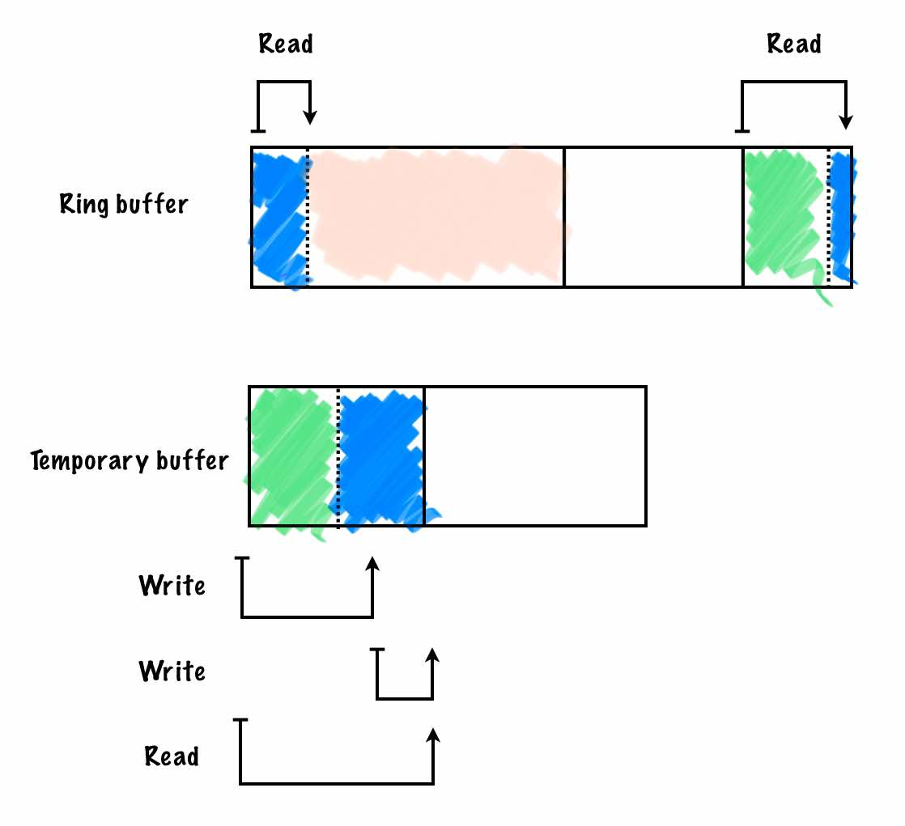

% Application blackbox

In aviation, a "black box" is the colloquial term for the [flight recorder][0],
a device that records the recent history of a flight. This device is designed
to be robust to a potential crash such that the recovered data can be later used
during investigation.

[blackbox][1] applies this idea to software. The principle goal of `blackbox`
is to enable applications to save arbitrary (but structured) data during
runtime and allow that data to survive any kind of crash, even `SIGKILL`. In
addition, the blackbox can be extracted from outside the application (live
or post-mortem) without introducing _any_ blocking in the application.

## API

Let's first start with the API. The following is the abbreviated
application-side API. The full documentation is available in [`blackbox.h`][2].

```c++
int init(std::size_t size = DEFAULT_SIZE) noexcept;

int write(std::string_view s) noexcept;
int write(std::int64_t i) noexcept;
int write(std::string_view key, std::string_view value) noexcept;
[..]

int dump(std::ostream &out);
```

For example, it could be used like this:

```c++
#include <chrono>
#include <cstring>
#include <iostream>
#include <thread>

#include "blackbox.h"

int main() {
  if (auto err = blackbox::init()) {
    std::cerr << std::strerror(-err) << std::endl;
    return 1;
  }

  blackbox::write("hello world!");
  blackbox::write(123);
  blackbox::write("key1", "val1");

  blackbox::dump(std::cout);
  std::this_thread::sleep_for(std::chrono::milliseconds(500));
}
```

which when run, would produce this output:

```
$ ./demo
hello world!
123
key1=val1
```

Alternatively, you could do a live external extraction:

```
$ ./demo >/dev/null &; ./extractor $(pidof demo)
hello world!
123
key1=val1
```

## Features

### Crash resilience

In line with the idea of a flight recorder, we want to save data in the event
of a crash. However, because `blackbox` implements this with POSIX shared
memory, we want to be conservative with system resources.  To that end,
`blackbox` registers an `atexit(3)` handler that unlinks the shared memory.
This is a clean mechanism that gives us for free the following properties:

1. Blackbox deletion on normal exit (return from `main()` or `std::exit()`)
2. Blackbox deletion on normal exit from signal handler
3. Blackbox preservation on unhandled signal (SIGSEGV, SIGABRT, etc.)
4. Blackbox preservation on uncatchable signal (SIGKILL)

The rationale behind properties 1 and 2 is that the application has the chance
to dump the blackbox so we can assume it will be explicitly preserved if
necessary. Property 2 is why `blackbox::dump()` is async-signal-safe. That is,
it can be safely called from signal handlers as long as `operator<<` on the
`std::ostream` is also async-signal-safe.

There are various corner cases (for example `_exit(3)` or `std::terminate()`)
that skip `atexit` handlers. In those cases, blackbox still achieves its design
goal but only fails to conserve resources. For this reason, it's recommended
to have a cron job or equivalent to reap old blackboxes.

### Non-blocking extraction

Above we mentioned POSIX shared memory. However, crash resilience is not the
only reason for this technical choice. Shared memory was chosen to also satisfy
our non-blocking design goal by exploiting shared memory's linux
implementation.

More specifically, POSIX shared memory is backed by a `tmpfs` mount at
`/dev/shm`. `mmap(2)`ing files in tmpfs does not acquire `mmap_lock` in the
application. Constrast this with something like a remote `process_vm_readv(2)`
which _will_ take `mmap_lock` in the application.

Why all the effort to avoid `mmap_lock`? `mmap_lock` is a [particularly
thorny subject][3] in the kernel. In particular, it's been known to cause
priority inversions during out-of-memory (OOM) scenarios, which `blackbox` was
initially designed to help troubleshoot. For this reason, we chose shared
memory as it will not induce any blocking in the application.

### Data consistency

So we communicate through shared memory, fine. But what about synchronization?

Traditionally, shared memory mutexes are chosen for synchronizing shared
memory. However, it has [somwhat peculiar corner cases][4] on top of being
blocking for the application even if we were to get clever with multi-reader
locks. Therefore, another solution was needed.

For `blackbox`, we chose to implement a userspace [sequence lock][5] (seqlock).
In short, a seqlock does not ever block the writer. Instead, the reader will
retry if a modification was detected during the read. This has all the
properties we need, except that excessive writes may starve readers. We don't
expect heavy writes to the blackbox, so this caveat is fine.

The same code is used during post-mortem extraction to check if the blackbox
crashed during a write. In the unlikely event that occurred, we would know the
data was lost. Or if we're OK with best effort, that the extracted data is
unreliable.

See further below for more details on the userspace seqlock.

### Structured data

{ width=100% }

Under the hood `blackbox` is backed by a ring buffer to bound memory usage.
However, unlike typical ring buffers, we write Tag-Length-Value (TLV) entries
into the ring. This is important for two reasons:

1. Arbitrary structured data can be supported
2. It allows for perfect forward compatability

An alternative to (1) would be to force the user to serialize all data to
strings. However, this prevents structured extraction. Monitoring systems (eg.
prometheus) support strongly typed data. It's wise to be sympathetic to modern
monitoring systems and allow users to leverage their full analytical power.

For (2), in the event that the extractor is newer than the application's
blackbox, we are fine as long as `blackbox` is careful about backwards
compatability. However, equally likely is if the extractor is older than the
application blackbox. In that case, TLVs allow the extractor to skip unknown
entries by looking at the type and length fields.

## Novel techniques

### Userspace sequence lock

Seqlocks are a somewhat obscure lock originating from the linux kernel. The
basic principle is that prior to entering write side critical section, a
sequence counter is incremented. Immediately after exiting the write side
critical section, the counter is incremented again. With this, the reader knows
it was interrupted during a read if the sequence counter value is **not even**
and **not the same** before and after the read. Since this is all done without
traditional locks, lock-free techniques must be carefully used.

`blackbox` offers a rather unique addition to the landscape in that we did a
somewhat thorough review of the literature before attempting an implementation,
going as far as discovering a [very small][6] but long-standing bug in the
kernel.  We also didn't find any userspace seqlock implementations that seemed
correct, so a custom implementation was called for.

Lock-free programming is a tricky topic, so we'll spare the details.  Suffice to
say, it's about controlling the observed order of memory operations.  In this
case, it's ensuring that the first sequence increment is visible before (and
the second sequence increment after) the critical section.

For reference, here are the writer and reader bits. They come with comments
which hopefully justify the choice of memory barriers.

Writer side critical section:

```c++
template <typename F> auto write_locked(F &&f) -> decltype(f()) {
  // Ensure only one writer is writing
  lock.lock();

  // Transition into write and prevent any stores from being reordered around
  // this increment.
  //
  // memory_order_acq_rel is chosen b/c the critial section (subsequent stores)
  // must not be reordered before the sequence is incremented.
  // memory_order_release is not sufficient as it only guarantees prior stores
  // are not reordered after the increment, and not the other way around (which
  // we need).
  blackbox->sequence.fetch_add(1, std::memory_order_relaxed);
  std::atomic_thread_fence(std::memory_order_acq_rel);

  // Write new entry
  auto retval = f();

  // Transition out of write and prevent any previous stores from being
  // reordered after this increment.
  //
  // Note we do not need acquire_release semantics like above b/c release
  // semantics are strong enough to ensure stores in the critical section will
  // be visible before the sequence increment.
  //
  // Any subsequent stores are free to move into the critical section if it
  // makes the program run faster. Any subsequent critical sections will be
  // fenced by its corresponding acquire_release increment.
  blackbox->sequence.fetch_add(1, std::memory_order_release);

  // Pair with above lock()
  lock.unlock();

  return retval;
}
```

Reader side critical section (abbreviated):

```c++
std::uint64_t read_seq(std::atomic_uint64_t &seq) {
  // memory_order_acquire is sufficient here b/c we only need ensure
  // subsequent loads are not reordered before the sequence load.
  //
  // The `& ~0x1` is just to ensure we retry in the event there is
  // a writer in the critical section. The sequence will be odd if
  // there is a write in progress.
  return seq.load(std::memory_order_acquire) & ~0x1ULL;
}

// Returns whether or not to retry the read critical section
bool read_retry(std::atomic_uint64_t &seq, std::uint64_t old_seq) {
  // memory_order_acq_rel is necessary here to ensure prior loads
  // are not reordered after the sequence load. memory_order_acquire
  // only guarantees subsequent loads are not reordered before the
  // sequence load, and not the other way around.
  //
  // If we see that the sequence was even _and_ unchanged before and
  // after the critical section, it means we got a consistent view
  // of the blackbox.
  std::atomic_thread_fence(std::memory_order_acq_rel);
  return seq.load(std::memory_order_relaxed) != old_seq;
}

bool work(Blackbox *bb) {
  std::uint64_t seq;

  do {
    seq = read_seq(bb->sequence);
    critial_section(bb);
  } while (read_retry(bb->sequence, seq));
}
```

### Double mapped ring buffer

One interesting consequence of writing TLVs into the ring buffer is that things
get tricky when the entry header is split between the beginning and the end of
the array. When this happens, a simple pointer cast to the entry is not
possible. Naively, you would copy the header to a temporary buffer sized to the
largest possible header:

{ width=70% }

But we can do better. `blackbox` makes use of a classic (but possibly esoteric)
ring buffer technique: double mapping:

{ width=100% }

With a double mapped ring buffer, it is always possible to do a linear read or
write. No extra memory is required - just an extra copy of page table entries
that the hardware resolves to the same physical memory. This solves the header
split problem on top of being more efficient.

Consider the case when the data portion of the entry needs to be split between
head and tail. The writer would need to either issue two `memcpy(3)`s or write
a loop containing a modulo on each iteration to simulate a ring-aware memcpy.
Both leave performance on the table:

* Two memcpy's makes poor use of hardware prefetching and branch prediction.
* A custom memcpy would be hard-pressed to make use of architecture specific
  optimized memcpy instructions. The modulo in each iteration is also
  relative expensive.

## Closing thoughts

There's currently no  plans to make the code any more reusable than it
currently is. If you want to use it, please reach out and we'll see what
can be done.


[0]: https://en.wikipedia.org/wiki/Flight_recorder
[1]: https://github.com/danobi/blackbox
[2]: https://github.com/danobi/blackbox/blob/master/blackbox.h
[3]: https://lwn.net/Articles/893906/
[4]: https://man7.org/linux/man-pages/man3/pthread_mutexattr_setrobust.3.html
[5]: https://en.wikipedia.org/wiki/Seqlock
[6]: https://lore.kernel.org/all/0eaea03ecc9df536649763cfecda356fc38b6938.1734477414.git.dxu@dxuuu.xyz/
