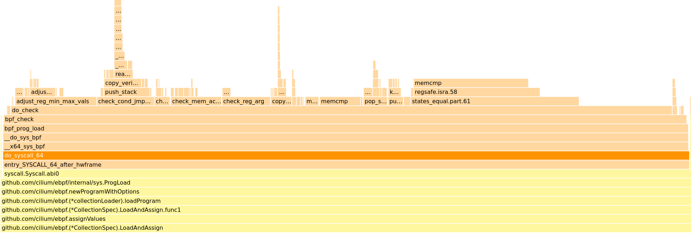

% BPF and go pprof

Earlier this week I was made aware of what appeared to be an infinite loop in
the in-kernel BPF verifier. Golang stacks were pulled, flamegraphs were
captured (shoutout to [profiler.firefox.com][2]), and by all appearances it
seemed like there was indeed an infinite loop.

{ width=100% }

I spent some time studying the verifier source and nothing really stood out to
me as infinite loopable. Plus, the flamegraph showed a rather equal
distribution of callees so the verifier being stuck in a single place seemed
unlikely.

By some random chance I thought it would be useful to see how often the
verifier was being called. I answered that question by running the following
bpftrace script for a few seconds:

```
$ sudo ./bpftrace -e 't:syscalls:sys_enter_bpf { @ = count(); }'
Attaching 1 probe...
^C

@: 932
```

So clearly this was not an infinite loop but rather `bpf(BPF_PROG_LOAD, ...)`
being called in a tight loop. That by itself seemed rather odd so I took to the
`cilium/ebpf` source. A quick dig turned up:


``` {#function .go .numberLines startFrom="16"}
// BPF wraps SYS_BPF.
//
// Any pointers contained in attr must use the Pointer type from this package.
func BPF(cmd Cmd, attr unsafe.Pointer, size uintptr) (uintptr, error) {
	for {
		r1, _, errNo := unix.Syscall(unix.SYS_BPF, uintptr(cmd), uintptr(attr), size)
		runtime.KeepAlive(attr)

		// As of ~4.20 the verifier can be interrupted by a signal,
		// and returns EAGAIN in that case.
		if errNo == unix.EAGAIN && cmd == BPF_PROG_LOAD {
			continue
		}

		var err error
		if errNo != 0 {
			err = wrappedErrno{errNo}
		}

		return r1, err
	}
}
```

Ah ha, so the looping condition is `-EAGAIN`. I quickly verified that by
running:

```
$ sudo ./bpftrace -e 't:syscalls:sys_exit_bpf { @[args->ret] = count(); }'
Attaching 1 probe...
^C

@[-11]: 543
```

`-EAGAIN` is `-11`, so great. That's confirmation.


To answer why the verifier would ever return `-EAGAIN`, I grepped through
`kernel/bpf/verifier.c`. It turns out there's precisely one occurence of
`-EAGAIN` in the file (which contains all verifier logic):


``` {#function .c .numberLines startFrom="12089"}
static int do_check(struct bpf_verifier_env *env)
{
        /* [...] */
        for (;;) {
                struct bpf_insn *insn;

                /* [...] */
                insn = &insns[env->insn_idx];
                class = BPF_CLASS(insn->code);

                /* [...] */
                if (signal_pending(current))
                        return -EAGAIN;

                /* Main logic follows */
```

So the only reason the verifier would return `-EAGAIN` is if there is a pending
signal waiting for the caller.

In general this would be pretty difficult to debug b/c any code modification
could potentially disturb the bad state. Fortunately, we can turn to bpftrace:

```
$ sudo ./bpftrace -e 't:syscalls:sys_exit_bpf { @[args->ret] = count(); } t:signal:signal_deliver / pid == $1 / { @sigs[args->sig] = count() }' $(pidof binary-under-investigation)
Attaching 2 probes...
^C

@[-11]: 876
@sigs[27]: 1136
```

Here lies the smoking gun: signal 27 is `SIGPROF`. From here, two things
were realized:

1. Go's built in CPU profiling [uses `SIGPROF` to sample][0]
1. We recently turned on continuous `pprof` based profiling

In other words, what was happening was:

1. The verifier was taking time for verification to complete
1. While the verifier was working, `pprof` was sending `SIGPROF` at high enough
  frequency to prevent verifier from completing its work
1. `cilium/ebpf` kept retrying `bpf(BPF_PROG_LOAD, ..)` because it received
  `-EAGAIN`s
1. All the above caused our process to spin on prog verification

## Conclusion

This was a really nice bug b/c it's simple to grok and totally non-obvious.

My only takeaway is that I'm not sure I like go's signal based profiling
mechanism.  It intereres quite heavily with long-running syscalls like
`bpf(BPF_PROG_LOAD, ...)`.  I would much rather prefer using [PMU-based][1]
profilers like `perf`.


[0]: https://cs.opensource.google/go/go/+/refs/tags/go1.19.1:src/runtime/pprof/pprof.go;l=755
[1]: https://easyperf.net/blog/2018/06/01/PMU-counters-and-profiling-basics
[2]: https://profiler.firefox.com/
