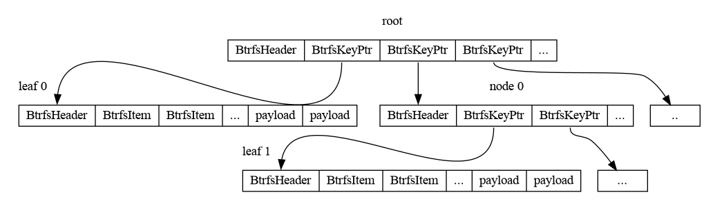

% Understanding btrfs internals part 3

This is the third of a multipart series that explains the basics of
[btrfs][0]'s on-disk format.

At the end of this series, we'll have a program that can print out the absolute
path of every regular file in an unmounted btrfs filesystem image without
external libraries or `ioctl(2)` calls.

Example code is available [here][1].

### Background

As explained in [part 2][2], btrfs stores nearly everything on-disk in B-trees.
And as promised, I'll now describe the B-tree data format. First, an example tree:

{ width=100% }

Each node in a btrfs B-tree is prefixed with a header. The header records the
node's "level". Level 0 means the node is a leaf node and stores a payload.
Level > 0 means the node is an internal node and stores pointers to children
nodes.  The header also stores the number of "items" the node contains where an
"item" is either a pointer to child node if `level > 0`, else, information on
where to find the payload in the node. Recall that each item in a node is
sorted by the associated `BtrfsKey` which allows for efficient binary searches.
There's also some other data but it's not too important to us.

In our example, `root` and `node 0` contain `BtrfsKeyPtr`s because they're not
leaf nodes. `leaf 0` and `leaf 1` contain `BtrfsItem`s because they _are_ leaf
nodes.

### Reading the chunk tree

Now that we understand how trees are laid out on disk, let's process the rest of
the chunk tree.

First, let's define the necessary structures:

``` {#function .rust}
#[repr(C, packed)]
#[derive(Copy, Clone)]
pub struct BtrfsHeader {
    pub csum: [u8; BTRFS_CSUM_SIZE],
    pub fsid: [u8; BTRFS_FSID_SIZE],
    /// Which block this node is supposed to live in
    pub bytenr: u64,
    pub flags: u64,
    pub chunk_tree_uuid: [u8; BTRFS_UUID_SIZE],
    pub generation: u64,
    pub owner: u64,
    pub nritems: u32,
    pub level: u8,
}

#[repr(C, packed)]
#[derive(Copy, Clone)]
pub struct BtrfsKeyPtr {
    pub key: BtrfsKey,
    pub blockptr: u64,
    pub generation: u64,
}

#[repr(C, packed)]
#[derive(Copy, Clone)]
pub struct BtrfsItem {
    pub key: BtrfsKey,
    pub offset: u32,
    pub size: u32,
}
```

Note that `BtrfsItem::offset` is the offset from the _end_ of the associated
`BtrfsHeader` that we can find the payload for the `BtrfsItem`.


[0]: https://en.wikipedia.org/wiki/Btrfs
[1]: https://github.com/danobi/btrfs-walk
[2]: btrfs-internals-2.html
