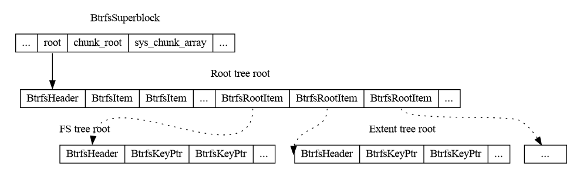

% Understanding btrfs internals part 4

This is the fourth of a multipart series that explains the basics of
[btrfs][0]'s on-disk format.

At the end of this series, we'll have a program that can print out the absolute
path of every regular file in an unmounted btrfs filesystem image without
external libraries or `ioctl(2)` calls.

Example code is available [here][1].

### Background

[Part 3][2] went into detail on how to walk an on-disk B-tree given the logical
address of a root node. However, not all tree roots are stored in the
superblock. To access any tree that isn't the chunk tree or the log tree, we
must locate the relevant root using the root tree root.

The root tree root contains references to all the other trees:

{ width=100% }

The superblock contains the logical address for the root tree root node. The
root tree root is a leaf node that contains `BtrfsRootItem`s as payloads.  The
`BtrfsRootItem`s contain references to other tree roots. Note that the solid
lines are direct references insofar as the reference is a `BtrfsKeyPtr`.  The
dashed line is a reference through other means.

Note that the root tree may also contain other item types. They're not
particularly interesting for our tool so we'll ignore them.

[0]: https://en.wikipedia.org/wiki/Btrfs
[1]: https://github.com/danobi/btrfs-walk
[2]: btrfs-internals-3.html
