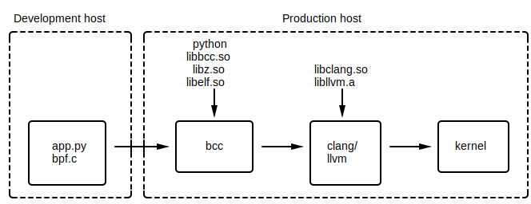

% libbpf-rs: eBPF for the Rust ecosystem

### Summary

libbpf-rs provides safe Rust bindings to libbpf as well as a cargo plugin to
help you develop "Compile Once Run Everywhere" eBPF applications. Use libbpf-rs
over BCC to produce smaller, more efficient, and more predictable applications.

### Background

eBPF (BPF) programs have traditionally been written using [BPF compiler
collection][0] (BCC). The application would then call into BCC using the C++ or
Python bindings. BCC has an "on-the-fly" model, meaning BPF programs are
compiled during runtime on production hosts. While this works, there are
drawbacks:

1. Every production machine needs kernel headers installed. These can get out
   of sync and can be missing internal headers.

1. LLVM/clang is heavyweight in both binary size and resource consumption. This
   is because BCC needs to compile the BPF program (written in C) down to BPF
   bytecode the kernel can understand.

1. End results can vary with kernel version and configuration. The BPF program
   can and will change depending on the host it's running on.

This diagram illustrates BCC's compilation and runtime model:

{ width=100% }

### Compile once run everywhere

[Compile once run everywhere][1] (CO-RE) is a development effort solves the
above issues by enabling ahead of time BPF program compilation. A summary of
developments include:

* [BPF type format][2] (BTF). You can think of BTF as a very light weight
  alternative to [DWARF][3]; light enough that you can write a parser in an
  afternoon. When the kernel is compiled with `CONFIG_DEBUG_INFO_BTF=y`, the
  final kernel image contains BTF entries for **all** internal data structures.
  Type definitions can then be extracted from BTF, obviating the kernel header
  dependency.

* Compiler (clang) support for relocatable field accesses. Consider accessing
  field `bar` from `struct Foo`. In BCC's model, BCC doesn't need to worry about
  `struct Foo`'s structure layout changing. That's because BCC compiles the program
  against the installed headers on every target host. This becomes an issue for
  CO-RE BPF progs. CO-RE BPF progs must have their field accesses relocated so
  that they reflect the target host's structure layouts.

* BPF loader ([libbpf][4]) support for BPF program fixups. libbpf must
  "custom-tailor" the BPF program for the target host it's running on.

More in-depth documentation as well as user facing APIs is available [here][1].

This diagram illustrates the CO-RE compilation and runtime model:

{ width=100% }

### Enter Rust

Why Rust? Rust's appeal (to systems programmers like myself) is its emphasis on
safety without compromising performance or expressiveness. As such, there are
powerful facilities for library designers to build abstractions that resist
misuse. This, coupled with the kernel's guarantee that a verified BPF program
(modulo bugs) can never crash, hang or interfere with the kernel negatively
makes Rust + BPF a very attractive combination.

[libbpf-rs][6] provides safe (w.r.t. Rust's `unsafe` keyword) bindings to
libbpf. On top of that, libbpf-rs is designed such that if your code can
compile, you're almost certainly using the library correctly. Much of that
guarantee comes from liberal use of newtype and builder APIs.

libbpf-cargo is a [cargo][5] plugin that integrates with cargo workflows Rust
programmers are already familiar with.

Together, libbpf-rs and libbpf-cargo provide CO-RE support in the Rust ecosystem.

### Rust skeleton

If you want to skip ahead and browse the unabridged example, look [here][8].

BPF skeletons started out as an alternative interface to libbpf. Its goal was
to simplify and reduce boilerplate when developing BPF applications. It ended
up being so successful that it's now the recommended interface. Naturally,
libbpf-rs supports Rust BPF skeletons.


Given BPF object files (eg `myobj.bpf.o`), `cargo libbpf gen` can generate Rust
skeletons for your object files. Consider [runqslower][7]: a prototypical BPF
application. `runqslower` shows high latency scheduling times between tasks
being ready to run and them running on CPU after that. Below is an abridged
copy of `runqslower.bpf.c` (the BPF program bits):

```{#function .c}
const volatile __u64 min_us = 0;
const volatile pid_t targ_pid = 0;
const volatile pid_t targ_tgid = 0;

struct {
	__uint(type, BPF_MAP_TYPE_HASH);
	__uint(max_entries, 10240);
	__type(key, u32);
	__type(value, u64);
} start SEC(".maps");

struct {
	__uint(type, BPF_MAP_TYPE_PERF_EVENT_ARRAY);
	__uint(key_size, sizeof(u32));
	__uint(value_size, sizeof(u32));
} events SEC(".maps");

SEC("tp_btf/sched_wakeup")
int handle__sched_wakeup(u64 *ctx);

SEC("tp_btf/sched_wakeup_new")
int handle__sched_wakeup_new(u64 *ctx);

SEC("tp_btf/sched_switch")
int handle__sched_switch(u64 *ctx);
```

To compile the object:

```
$ cd $RUST_PROJECT_ROOT

$ # Program sources must be placed in `src/bpf`
$ find . -name runqslower.bpf.c
./src/bpf/runqslower.bpf.c

$ # If you haven't already
$ cargo install libbpf-cargo

$ cargo libbpf build
```

To generate the skeleton:
```
$ cargo libbpf gen

$ # Generated skeleton files are placed in `src/bpf`
$ find . -name runqslower.skel.rs
./src/bpf/runqslower.skel.rs
$ find . -name mod.rs
./src/bpf/mod.rs
```

The following is example code that drives the skeleton:

```{#function .rust}
mod bpf;
use bpf::*;

fn main() -> Result<()> {
    // Open skeleton
    let mut skel_builder = RunqslowerSkelBuilder::default();
    let mut open_skel = skel_builder.open()?;

    // Write arguments into prog
    open_skel.rodata().min_us = 42;  // The answer to everything
    open_skel.rodata().targ_pid = 1;
    open_skel.rodata().targ_tgid = 1;

    // Load skeleton into kernel
    let mut skel = open_skel.load()?;

    // Attach progs to attach points
    skel.attach()?;

    // Set up ring buffer processing
    let perf = libbpf_rs::PerfBufferBuilder::new(skel.maps().events())
        .sample_cb(handle_event)
        .lost_cb(handle_lost_events)
        .build()?;

    // Process entries from ring buffer
    loop {
        perf.poll(core::time::Duration::from_millis(100))?;
    }
}

fn handle_event(cpu: i32, data: &[u8]) {
    unimplemented!();
}

fn handle_lost_events(cpu: i32, count: u64) {
    unimplemented!();
}
```

Note there's no mention of the `runqslower.bpf.o` file anywhere. That's because
the contents of the object file have been embedded into the skeleton file
(using `include_bytes!()` macro). As a result, you don't have to worry about
shipping BPF object files along with your application binaries.

Also note how `open_skel.rodata()` and `skel.maps()` is infallible. Generated
skeletons have infallible accessors for all maps, programs, and global
variables. This reduces the number of errors your application can encounter at
runtime.

Finally, note how we can set and get values for global data. `cargo libbpf gen`
can read the BTF (that clang generates for the object file) and generate
appropriate Rust definitions. These structures are then `mmap()`ed to the
kernel at runtime. Global data is the most convenient way to communicate with
BPF programs from userspace. Simply read and write values as you normally
would.  Note that `OpenRunqslowerSkel::rodata()` returns a mutable reference to
the read-only data and `RunqslowerSkel::rodata()` returns immutable reference.
That's because constant values can only be set before the program is loaded
into the kernel. Safety at work!

To build the application:

```
$ cargo libbpf make
...
$ sudo ./target/debug/runqslower
...
```

### fbcode support

XXX remove for open source

Use the `rust_bpf_library()` buck macro:

```
load("//kernel/bpf:defs.bzl", "rust_bpf_library")

rust_binary(
    name = "mybinary",
    src = ["src/main.rs"],
    deps = [":mybpfprog"],
)

rust_bpf_library(
    name = "mybpfprog",
    bpf_srcs = ["src/bpf/mybpfprog.bpf.c"],
)
```

`rust_bpf_library()` generates a Rust skeleton for your BPF object file and
places the skeleton into a `rust_library()` target. The name of the `rust_library()`
target is the name you specify to `rust_bpf_library()`.

In `main.rs`, use `mybpfprog` as you would any other Rust library. Note that in
fbcode you need not worry about `cargo libbpf`'s imposed filesystem structure.

### Conclusion

If you have questions (you most likely do) about libbpf-rs, please consult the
official documentation:

* [libbpf-rs docs.rs][9]
* [libbpf-cargo docs.rs][11] and `cargo libbpf --help`
* [runqslower docs][10]

If you have more questions / concerns after that, please reach out to me in any
way possible.

[0]: https://github.com/iovisor/bcc
[1]: https://facebookmicrosites.github.io/bpf/blog/2020/02/19/bpf-portability-and-co-re.html
[2]: https://www.kernel.org/doc/html/latest/bpf/btf.html
[3]: https://en.wikipedia.org/wiki/DWARF
[4]: https://github.com/libbpf/libbpf
[5]: https://doc.rust-lang.org/cargo/
[6]: https://github.com/libbpf/libbpf-rs
[7]: https://github.com/iovisor/bcc/blob/a55192b26d0a9294ed4e0bcd8170225dad62dd61/tools/runqslower_example.txt
[8]: https://github.com/libbpf/libbpf-rs/tree/master/examples/runqslower
[9]: https://docs.rs/libbpf-rs
[10]: https://github.com/libbpf/libbpf-rs/blob/master/examples/runqslower/README.md
[11]: https://docs.rs/libbpf-cargo
