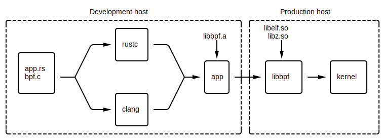

% libbpf-rs: eBPF for the Rust ecosystem

### Background

eBPF (BPF) programs have traditionally been written using [BPF compiler
collection][0] (BCC). The application would then call into BCC using the C++ or
Python bindings. BCC has an "on-the-fly" model, meaning BPF programs are
compiled during runtime on production host. While this works, there are
drawbacks:

1. Every production machine needs kernel headers installed. These can get out
   of sync and can be missing internal headers.

1. LLVM/clang is heavyweight in both binary size and resource consumption. This
   is because BCC needs to compile the BPF program (written in C) down to BPF
   bytecode the kernel can understand.

1. End results can vary with kernel version and configuration. The BPF program
   can and will change depending on the host it's running on.

This diagram illustrates BCC's compilation and runtime model:

{ width=100% }

### Compile once run everywhere

[Compile once run everywhere][1] (CO-RE) is a development effort that aims to
(and does) solve the above issues by enabling ahead of time BPF program
compilation. A summary of developments include:

* [BPF type format][2] (BTF). You can think of BTF as a very light weight
  alternative to [DWARF][3]; light enough that you can write a parser in an
  afternoon. When the kernel is compiled with `CONFIG_DEBUG_INFO_BTF=y`, the
  final kernel image contains BTF entries for **all** internal data structures.
  Type definitions can then be extracted from BTF, obviating the need for
  kernel headers to be installed.

* Compiler (clang) support for relocatable field accesses. Consider accessing
  field `bar` from `struct Foo`. In BCC's model, BCC doesn't need to worry about
  `struct Foo`'s structure layout changing. That's because BCC compiles the program
  against the installed headers on every target host. This becomes an issue for
  CO-RE BPF progs. CO-RE BPF progs must have their field accesses relocated so
  that they reflect the target machine's structure layouts.

* BPF loader ([libbpf][4]) support for BPF program fixups. libbpf must
  "custom-tailor" the BPF program for the target host it's running on.

More in-depth documentation as well as user facing APIs is available [here][1].

This diagram illustrates the CO-RE compilation and runtime model:

{ width=100% }

### Enter Rust

Why Rust? Rust's appeal (to systems programmers like myself) is its emphasis on
safety without compromising on performance or expressiveness. As such, there are
powerful facilities for library designers to build abstractions that resist
misuse. This, coupled with the kernel's guarantee that a verified BPF program
(modulo bugs) can never crash, hang or interfere with the kernel negatively,
makes Rust + BPF a very attractive combination.

[libbpf-rs][6] provides safe (w.r.t. Rust's `unsafe` keyword) bindings to
libbpf. On top of that, libbpf-rs is designed such that if your code can
compile, you're almost certainly using the library correctly. Much of that
guarantee comes from liberal use of newtype and builder patterns.

libbpf-cargo is a [cargo][5] plugin that integrates with cargo workflows Rust
programmers are already familiar with.

Together, libbpf-rs and libbpf-cargo provide CO-RE support in the Rust ecosystem.

### Rust skeleton

NOTE: if you want to skip ahead and browse the unabridged example, look
[here][8].

BPF skeletons started out as an alternative interface to libbpf. It's goal was
to simplify and reduce boilerplate when developing BPF applications. In fact,
it was so successful that it's now the recommended interface. Naturally,
libbpf-rs supports Rust BPF skeletons.


Given a BPF object file (eg `myobj.bpf.o`), `cargo libbpf gen` can generate a
Rust skeleton for your object file. Consider [runqslower][7]: a prototypical
BPF application. `runqslower` shows high latency scheduling times between tasks
being ready to run and them running on CPU after that. Below is an abridged
copy of `runqslower.bpf.c`, the BPF program bits:

```{#function .c}
const volatile __u64 min_us = 0;
const volatile pid_t targ_pid = 0;
const volatile pid_t targ_tgid = 0;

struct {
	__uint(type, BPF_MAP_TYPE_HASH);
	__uint(max_entries, 10240);
	__type(key, u32);
	__type(value, u64);
} start SEC(".maps");

struct {
	__uint(type, BPF_MAP_TYPE_PERF_EVENT_ARRAY);
	__uint(key_size, sizeof(u32));
	__uint(value_size, sizeof(u32));
} events SEC(".maps");

static __always_inline int trace_enqueue(u32 tgid, u32 pid);

SEC("tp_btf/sched_wakeup")
int handle__sched_wakeup(u64 *ctx);

SEC("tp_btf/sched_wakeup_new")
int handle__sched_wakeup_new(u64 *ctx);

SEC("tp_btf/sched_switch")
int handle__sched_switch(u64 *ctx);
```

As you can see, the object has 3 global variables (`min_us`, `targ_pid`,
`targ_tgid`), 2 maps (`start`, `events`), and 3 programs
(`handle__sched_wakeup`, `handle__sched_wakeup_new`, `handle__sched_switch`).

To compile the object:

```
$ cd $RUST_PROJECT_ROOT

$ # Program sources must be placed in `src/bpf`
$ find . -name runqslower.bpf.c
./src/bpf/runqslower.bpf.c

$ # If you haven't already
$ cargo install libbpf-cargo

$ cargo libbpf build
```

To view what a generated skeleton would look like:
```
$ cargo libbpf gen --object target/bpf/runqslower.bpf.o
[...]
```

Below is an abridged skeleton:

```{#function .rust}
pub struct RunqslowerSkelBuilder { ... }
impl RunqslowerSkelBuilder {
    pub fn open(&mut self) -> libbpf_rs::Result<OpenRunqslowerSkel>
}

pub struct OpenRunqslowerMaps<'a> { ... }
impl<'a> OpenRunqslowerMaps<'a> {
    pub fn start(&mut self) -> &mut libbpf_rs::OpenMap
    pub fn events(&mut self) -> &mut libbpf_rs::OpenMap
}

pub struct OpenRunqslowerProgs<'a> { ... }
impl<'a> OpenRunqslowerProgs<'a> {
    pub fn handle__sched_wakeup(&mut self) -> &mut libbpf_rs::OpenProgram
    pub fn handle__sched_wakeup_new(&mut self) -> &mut libbpf_rs::OpenProgram
    pub fn handle__sched_switch(&mut self) -> &mut libbpf_rs::OpenProgram
}

pub mod runqslower_rodata_types {
    #[repr(C)]
    pub struct rodata {
        pub min_us: u64,
        pub targ_pid: i32,
        pub targ_tgid: i32,
    }
}

pub struct OpenRunqslowerSkel<'a> { ... }
impl<'a> OpenRunqslowerSkel<'a> {
    pub fn load(mut self) -> libbpf_rs::Result<RunqslowerSkel<'a>>;
    pub fn progs(&mut self) -> OpenRunqslowerProgs;
    pub fn maps(&mut self) -> OpenRunqslowerMaps;
    pub fn rodata(&mut self) -> &'a mut runqslower_rodata_types::rodata;
}

pub struct RunqslowerMaps<'a> { .. }
impl<'a> RunqslowerMaps<'a> {
    pub fn start(&mut self) -> &mut libbpf_rs::Map
    pub fn events(&mut self) -> &mut libbpf_rs::Map
}

pub struct RunqslowerProgs<'a> { ... }
impl<'a> RunqslowerProgs<'a> {
    pub fn handle__sched_wakeup(&mut self) -> &mut libbpf_rs::Program
    pub fn handle__sched_wakeup_new(&mut self) -> &mut libbpf_rs::Program
    pub fn handle__sched_switch(&mut self) -> &mut libbpf_rs::Program
}

pub struct RunqslowerLinks {
    pub handle__sched_wakeup: Option<libbpf_rs::Link>,
    pub handle__sched_wakeup_new: Option<libbpf_rs::Link>,
    pub handle__sched_switch: Option<libbpf_rs::Link>,
}

pub struct RunqslowerSkel<'a> {
    pub links: RunqslowerLinks,
    ...
}
impl<'a> RunqslowerSkel<'a> {
    pub fn progs(&mut self) -> RunqslowerProgs
    pub fn maps(&mut self) -> RunqslowerMaps
    pub fn rodata(&mut self) -> &'a runqslower_rodata_types::rodata
    pub fn attach(&mut self) -> libbpf_rs::Result<()>
}
```

Note there's no mention of the `runqslower.bpf.o` file anymore. That's because
the contents of the object file have been embedded into the skeleton file
(using `include_bytes!` macro). As a result, your application no longer has to
worry about shipping all the object files along with your binary(ies).

Also note how for each of the 3 globals, 2 maps, and 3 programs, there are infallible
accessorrs. This reduces the number of errors your application can encounter at
runtime.

Finally, note the definitions for global data. `cargo libbpf gen` can read the BTF
(that clang generates for the object file) and generate appropriate Rust definitions.
Global data is the most convenient way to communicate with BPF programs from userspace.

To set the value of the constant `min_us`, simply write from userspace:

```{#function .rust}
open_skel.rodata().min_us = 42;  // The answer to life
```

Note that `OpenRunqslowerSkel::rodata()` returns a mutable reference to the
read-only data and `RunqslowerSkel::rodata()` returns immutable reference.
That's because constant values can only be set before the program is loaded
into the kernel. Safety at work!


### fbcode support

XXX remove for open source

Use the `rust_bpf_library()` buck macro:

```
load("//kernel/bpf:defs.bzl", "rust_bpf_library")

rust_binary(
    name = "mybinary",
    src = ["src/main.rs"],
    deps = [":mybpfprog"],
)

rust_bpf_library(
    name = "mybpfprog",
    bpf_srcs = ["src/bpf/mybpfprog.bpf.c"],
)
```

`rust_bpf_library()` generates a Rust skeleton for your BPF object file and
places the skeleton into a `rust_library()` target. The name of the `rust_library()`
target is the name you specify to `rust_bpf_library()`.

Then in `main.rs`, use `mybpfprog` as you would any other Rust library.

### Conclusion

If you have questions (you most likely do) about libbpf-rs, please consult the
official documentation:

* [libbpf-rs docs.rs][9]
* `cargo libbpf --help`
* [runqslower docs][10]

If you have more questions / concerns after that, please reach out to me in any
way possible.

[0]: https://github.com/iovisor/bcc
[1]: https://facebookmicrosites.github.io/bpf/blog/2020/02/19/bpf-portability-and-co-re.html
[2]: https://www.kernel.org/doc/html/latest/bpf/btf.html
[3]: https://en.wikipedia.org/wiki/DWARF
[4]: https://github.com/libbpf/libbpf
[5]: https://doc.rust-lang.org/cargo/
[6]: https://github.com/libbpf/libbpf-rs
[7]: https://github.com/iovisor/bcc/blob/a55192b26d0a9294ed4e0bcd8170225dad62dd61/tools/runqslower_example.txt
[8]: https://github.com/libbpf/libbpf-rs/tree/master/examples/runqslower
[9]: https://docs.rs/libbpf-rs/latest/libbpf_rs/index.html
[10]: https://github.com/libbpf/libbpf-rs/blob/master/examples/runqslower/README.md
