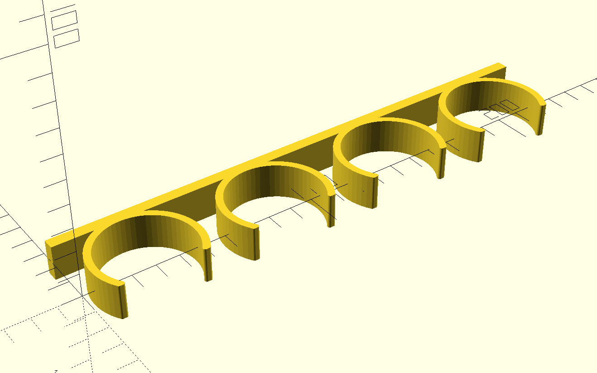
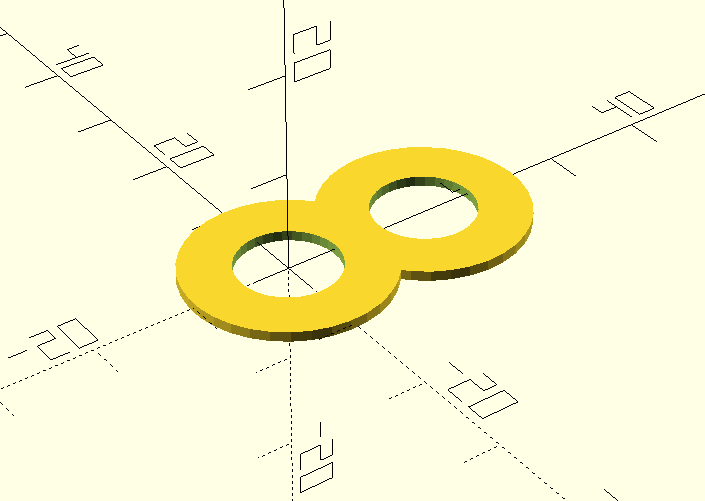
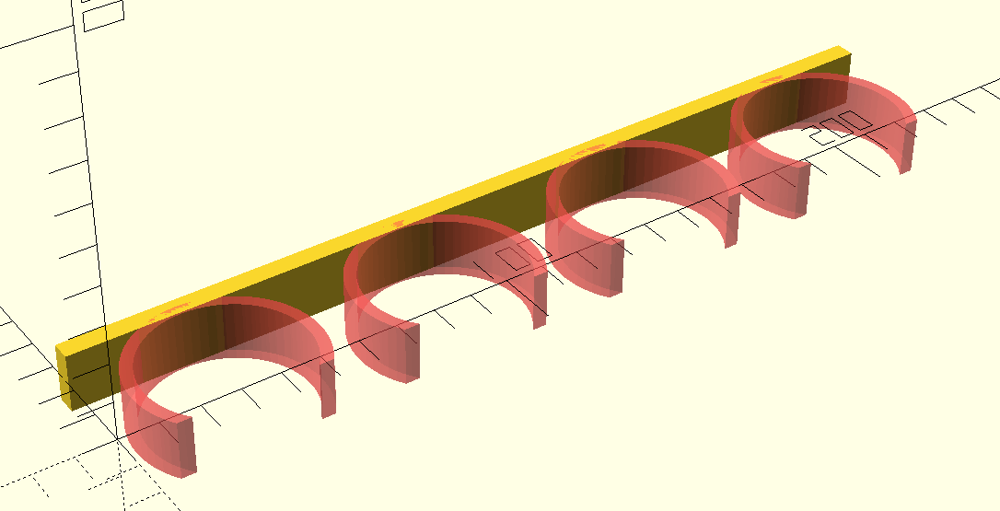

% 3D modeling with OpenSCAD

### The Boring Background

A few months ago I got tired of commuting to the local hacker space so I bought
a [cheap 3D printer][0] to use at home. Like any good 3D printing neophyte, I
printed quite a few precooked models before getting the itch to design some of
my own.

The biggest hurdle ended up being that I couldn't find good modeling software
o run on Linux. I tried out [FreeCAD][1] as well as [Blender][2] but found them
hard to get started with. Eventually I stumbled upon [OpenSCAD][3] which I ended
up absolutely loving. So hopefully this is the first of at least a few posts
where I dive into some of the things I've learned.

### Spice holder

There's obviously a lot of useful things you can make with a 3D printer. For my
first project, I decided on a spice holder for two reasons:

1. My spice cabinet is a total mess and it take forever to find anything.
1. It's a simple geometry, meaning I could focus most of my attention on
   learning the tooling.

Here's the final design for reference:

{ width=100% }

### A quick primer

I'm not really an expert at 3D modeling so I won't say too much about the
theory. But based on my limited research, I found OpenSCAD's marriage between
declarative scripting and constructive solid geometry (CSG) to be a wonderfully
elegant combination.

The premise behind CSG is that there are a limited set of 2D and 3D primitives
such as squares, circles, spheres, cylinders, cubes, etc. which can be combined
with with boolean operators to yield complex geometries. For example, with the
following code, you can take the union of a cube and a sphere to yield a
cube-sphere fusion:

```
union() {
    cube([5, 5, 5], center=true);
    translate([5, 0, 0])
        sphere(r=3);
}
```

{ width=100% }

Boolean expressions are not limited to single combinations -- they can be
nested arbitrarily. Consider this following example:

```
module ring() {
    difference() {
        circle(r=10);
        circle(r=5);
    }
}

linear_extrude(15) {
    union() {
        translate([15, 0, 0]) ring();
        ring();
    }
}
```

{ width=49% }
{ width=50% }

<center>
Before (left) and after extrusion (right)
</center>

The basic idea is we first create two rings, one next to the other. We then
take the two rings and join them with a union. Finally, take the union and
extrude along Z axis to create the final binocular shape.

The final other technique we use is a `module`. A module, take in the context
of C/C++ like languages, is more or less a macro. We don't use any parameters
in the macro here, but we could have.

Knowing these basics, we move onto the design of the spice rack.

### Spice holder design

To start, we create the backboard:

```
translate([(225/2), 25, 0])
    cube([225, 5, 15], center=true);
```

{ width=100% }

We translate the backboard a bit so that it's length is easier to eyeball on
the X axis and so it's arms are more easily positioned on the Y axis. Note that
OpenSCAD is unitless but my slicer (Cura) interprets the units as millimeters.

Next we create the arms:

```
inner_radius = 20;
outer_radius = inner_radius + 3;

module arm() {
    difference() {
        intersection() {
            circle(outer_radius);
            translate([0, 7.8, 0])
                square([500, 41], center=true);
        }
        circle(inner_radius);
    }
}

for (i=[0:3]) {
    translate([i*56.5 + 28, 2, 0])
        #arm();
}
```

{ width=100% }

The arms follow a similar design to the examples above. We make each arm by
intersecting two circles and slicing off the end so the spices can fit.  And
instead of making one, we make four by using a `for` loop.

One practical tidbit that we make use of is prefixing each arm with `#` to give
it a different render color. This is useful for quickly eyeballing changes to
your model. In this case, we'll be using it to illustrate the changes from the
previous code snippet.

Once we have the 2D arms, all that's left is to extrude them to the appropriate
height:

```
module arm() {
    #linear_extrude(15, center=true) {
        // Previous contents of `arm()`
    }
}
```

{ width=100% }

At this point we have a functional model. In fact, this is what I have printed
and installed in my cabinets. However, there's one small thing left for
improvement: the tips of the arms. The tips are slightly sharp and could use
some rounding out. To achieve this, we'll use a [Minkowski Sum][4].

Minkowski sums are relatively hard to explain with text but surprisingly easy
to understand with a visualization. In the linked animation, the basic idea is
that the sum of two nodes involves running the child node around the edges of
the parent node and adding the shape that the motion creates to the parent
node. In our use case, we'll subtract an additional unit off the outer arm
circle and replace the missing volume with the Minkowski sum of a sphere of the
same dimension.

In code, this looks like:

```
minkowski_radius = 1;

module arm() {
    linear_extrude(15, center=true) {
        minkowski() {
            difference() {
                intersection() {
                    circle(outer_radius-minkowski_radius);
                    translate([0, 7.8, 0])
                        square([500, 41-minkowski_radius], center=true);
                }
                circle(inner_radius+minkowski_radius);
            }
            circle(minkowski_radius);
        }
    }
}
```

With this we arrive at the model displayed in the beginning of this post,
something that looks a little like:

{ width=100% }


### Conclusion

Obviously this is not a complicated geometry. In fact, a mechanical engineer
friend of mine was timed creating a similar model using professional tooling
and it took about 90 seconds for him. Despite that, I still think this was a
really enjoyable process. I particularly love how the entire language fits on a
[small cheat sheet][5] -- something unimaginable for industrial grade tools. As
they say, a minute to learn but a lifetime to master. That more or less captures
why I think OpenSCAD is such an elegant tool.


[0]: https://www.creality.com/products/ender-3-v2-3d-printer-csco
[1]: https://www.freecad.org/
[2]: https://www.blender.org/
[3]: https://openscad.org/
[4]: https://www.youtube.com/watch?v=hKVBJMHivA4
[5]: https://openscad.org/cheatsheet/
