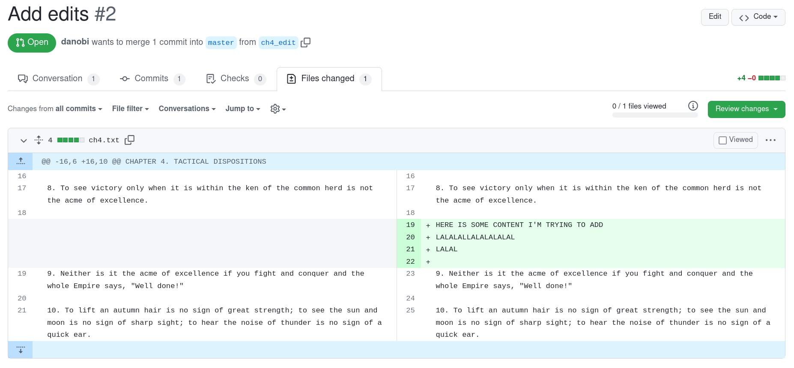

% Pull request review (prr)

Last month I developed a new tool that brings mailing-list style code reviews
to github. The tool was born out of frustration with github's point and click
web UI. Since I do a lot of code review, the tabbing between my text editor and
my browser became a constant source of friction.

Ideally, I wanted to stay in my text editor so that my code writing and code
reviewing workflows could be unified. I didn't find any such tool on the
internet so I built my own.

### Demo

Consider the following pull request:

{ width=100% }

To download the PR for review:

```
$ prr get danobi/prr-test-repo/2
/home/dxu/dev/review/danobi/prr-test-repo/2.prr
```

When you open the review file, you'll see:

```diff
> diff --git a/ch4.txt b/ch4.txt
> index 41e1932..8741175 100644
> --- a/ch4.txt
> +++ b/ch4.txt
> @@ -16,6 +16,10 @@ CHAPTER 4. TACTICAL DISPOSITIONS
>
>  8. To see victory only when it is within the ken of the common herd is not the acme of excellence.
>
> +HERE IS SOME CONTENT I'M TRYING TO ADD
> +LALALALLALALALALAL
> +LALAL
> +
>  9. Neither is it the acme of excellence if you fight and conquer and the whole Empire says, "Well done!"
>
>  10. To lift an autumn hair is no sign of great strength; to see the sun and moon is no sign of sharp sight; to hear the noise of thunder is no sign of a quick ear.
```

Now suppose you want to have the author remove the extraneous edits
and reject the PR because of it. Simply mark up the review file as follows:

```diff
@prr reject

> diff --git a/ch4.txt b/ch4.txt
> index 41e1932..8741175 100644
> --- a/ch4.txt
> +++ b/ch4.txt
> @@ -16,6 +16,10 @@ CHAPTER 4. TACTICAL DISPOSITIONS
>
>  8. To see victory only when it is within the ken of the common herd is not the acme of excellence.
>

> +HERE IS SOME CONTENT I'M TRYING TO ADD
> +LALALALLALALALALAL
> +LALAL
> +

Remove this junk

>  9. Neither is it the acme of excellence if you fight and conquer and the whole Empire says, "Well done!"
>
>  10. To lift an autumn hair is no sign of great strength; to see the sun and moon is no sign of sharp sight; to hear the noise of thunder is no sign of a quick ear.
```

Two things to note:

1. We can use `prr` directives by "tagging" `@prr`. Just like how you might use a github bot.
1. We added a "spanned" comment on the hunk by adding a newline before the start of the span.

To submit the review back to github, run:

```
$ prr submit danobi/prr-test-repo/2
```

You'll now see something like this on github:

{ width=100% }

(Note that you don't see the "Changes requested" in this example because github
doesn't let you request changes on your own PR. It should work on a real PR.)

### Looking forward

The above demo shows off most of the features I've currently implemented. There's
still a few things I want to add but they're not too pressing as I'm currently using
`prr` every day just fine.

If you wanna try out `prr` or request new features, feel free to file an issue or open
a PR at https://github.com/danobi/prr .
