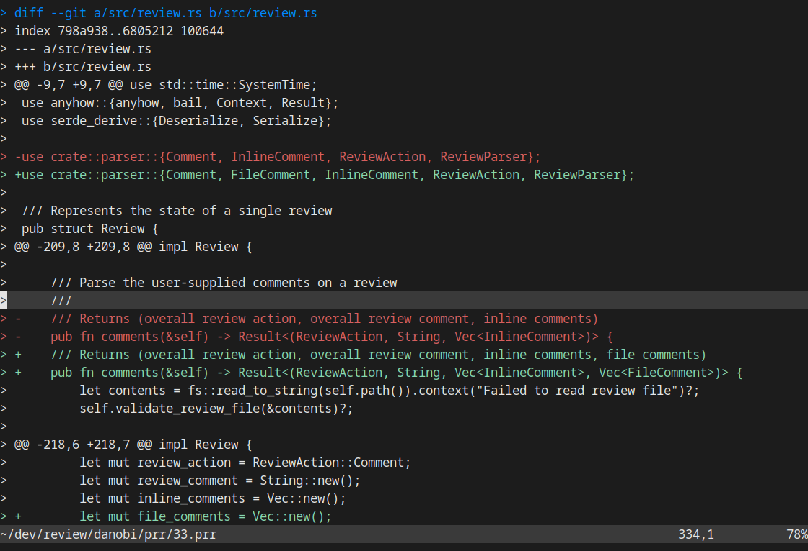
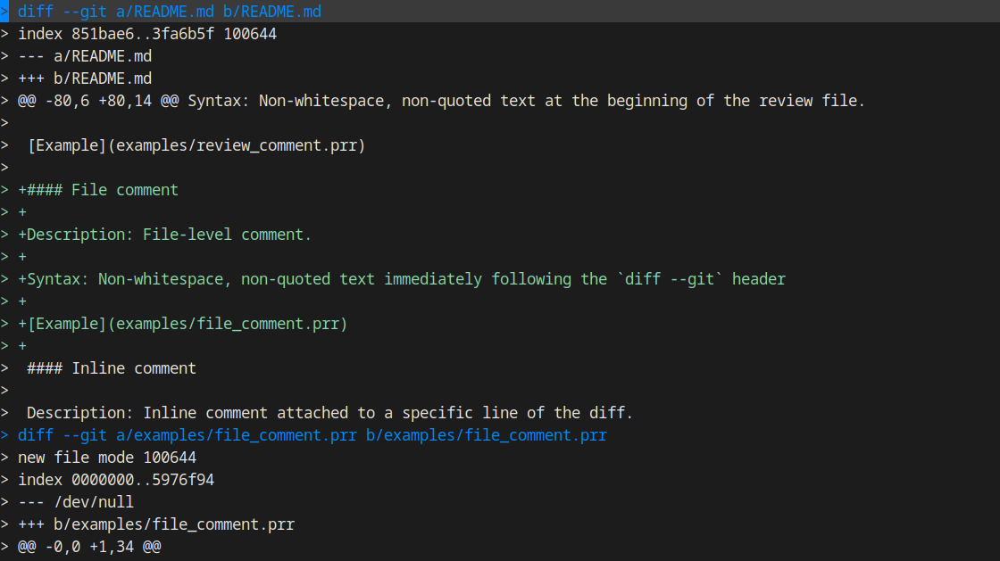
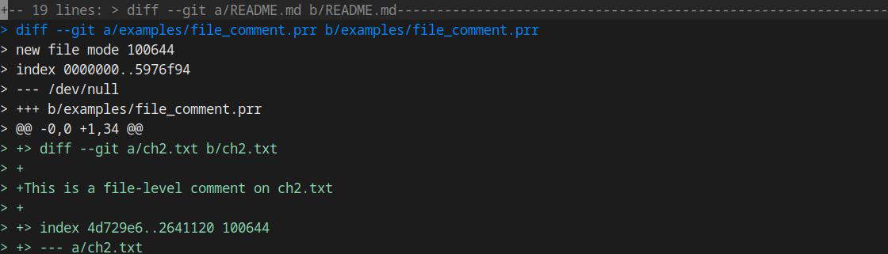
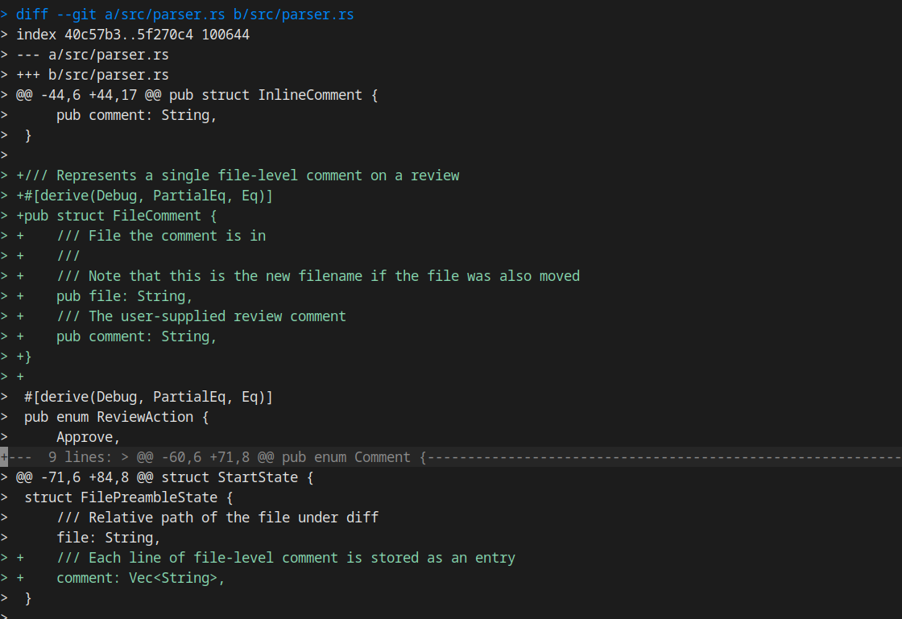
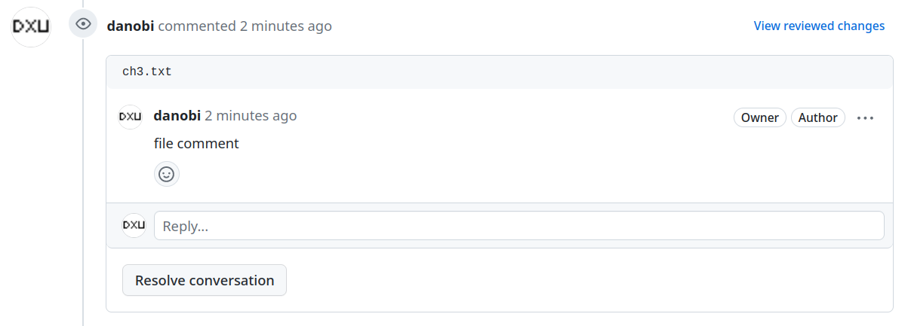

% Pull request review: still files!

It's been [about a year][0] since the core `prr` features features went in.
From my perspective, one surprising thing is that there's now a small group of
dedicated users who not only report bugs, but are also willing to implement new
features! Speaking for myself, the only thing better to a maintainer than happy
users are happy users who also send high quality PRs.

The following are some of the major features that myself or others have added.
And as always, reviews are still files!

## Review management

There is now rudimentary support for review management. To get a quick look
at local state, run `prr-status`:

```shell
$ prr status
Handle                  Status     Review file
danobi/prr/18           NEW        /home/dxu/dev/review/danobi/prr/18.prr
danobi/prr/20           NEW        /home/dxu/dev/review/danobi/prr/20.prr
danobi/prr/33           NEW        /home/dxu/dev/review/danobi/prr/33.prr
danobi/prr-test-repo/3  SUBMITTED  /home/dxu/dev/review/danobi/prr-test-repo/3.prr
iovisor/bpftrace/2387   NEW        /home/dxu/dev/review/iovisor/bpftrace/2387.prr
iovisor/bpftrace/2392   REVIEWED   /home/dxu/dev/review/iovisor/bpftrace/2392.prr
iovisor/bpftrace/2397   NEW        /home/dxu/dev/review/iovisor/bpftrace/2397.prr
iovisor/bpftrace/2399   SUBMITTED  /home/dxu/dev/review/iovisor/bpftrace/2399.prr
```

On top of the existing `prr-submit` you can now also:

* `prr-apply` to locally apply a review file to your working directory
* `prr-remove` and to delete a review file

## Advanced Vim integration (syntax colors)

To enable advanced Vim integration, simply add this (or simliar) to your plugin
manager config:

```vim
Plugin 'danobi/prr', {'rtp': 'vim/'}
```

You can now control exactly what syntax colors are used down to a fairly low
level. This is relatively important for viewing diffs as otherwise it's
visually difficult to pick out changes.

For example, I have this in my `.vimrc`:

```vim
"Automatically set up highlighting for `.prr` review files
augroup Prr
  autocmd!
  autocmd BufRead,BufNewFile *.prr set syntax=on

  "Make prr added/deleted highlighting more apparent
  autocmd BufRead,BufNewFile *.prr hi! link prrAdded Function
  autocmd BufRead,BufNewFile *.prr hi! link prrRemoved Keyword
  autocmd BufRead,BufNewFile *.prr hi! link prrFile Special

  "Make file delimiters more apparent
  autocmd BufRead,BufNewFile *.prr hi! link prrHeader Directory

  "Reduce all the noise from color
  autocmd BufRead,BufNewFile *.prr hi! link prrIndex Special
  autocmd BufRead,BufNewFile *.prr hi! link prrChunk Special
  autocmd BufRead,BufNewFile *.prr hi! link prrChunkH Special
  autocmd BufRead,BufNewFile *.prr hi! link prrTagName Special
  autocmd BufRead,BufNewFile *.prr hi! link prrResult Special
augroup END
```

and this is how my review files look:

{ width=100% }

## Advanced Vim integration (diff-aware folds)

Folds are useful in general. But for diff review they are extremely powerful.
If you install `prr`'s Vim "plugin" (as shown above), then this works out of
the box.

For `prr` reviews, folds allow you to mark regions as "done" for organization.
For example, when I'm done reviewing a file in a multi-file PR, I'll close the
file's fold. You do this by putting your cursor inside the file preamble
hitting `za` to toggle the fold:

So from this:

{ width=100% }

to this:

{ width=100% }

The same also works for hunks _inside_ a file. For example, this shows
the second hunk in `src/parser.rs` as folded:

{ width=100% }

Thanks [@hauleth][1] for adding better Vim integration!

## File level comments

Github recently added the ability to comment on entire files. `prr` now
also supports this functionality. A file level comment might look something
like:

```
> diff --git a/ch3.txt b/ch3.txt

file comment

> index 159cf1c..20814b6 100644
> --- a/ch3.txt
> +++ b/ch3.txt
> @@ -8,22 +8,6 @@ CHAPTER 3. ATTACK BY STRATAGEM
>                                                                                                               >  4. The rule is, not to besiege walled cities if it can possibly be avoided. The preparation of mantlets, movable shelters, and various implements of war, will take up three whole months; and the piling up of mounds over against the walls will take three months more.
>
```

When submitted, the web UI shows:

{ width=100% }

Thanks [@bcspragu][2] for adding this!

[0]: https://dxuuu.xyz/prr.html
[1]: https://github.com/hauleth
[2]: https://github.com/bcspragu
