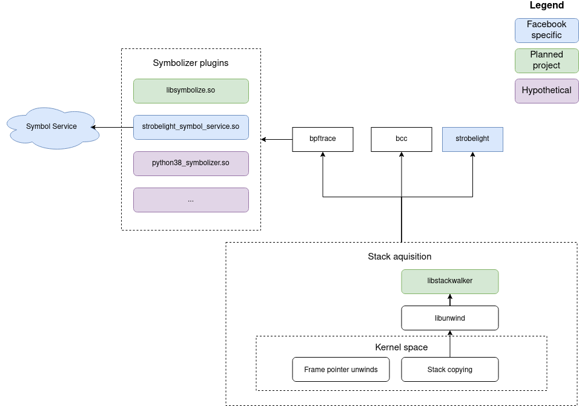

% DWARF stack walks and fast symbolization for BPF

**10/12/21 update: I have no immediate plans to work on this b/c I've recently
switched jobs. If you're really dying to see this implemented maybe we can work
something out. Just email me.**

## Background

In this document we are proposing solutions for two separate but related
problems: stack walking and symbolization. We'll first go over stack walking
and then symbolization.

### Stack walking

A call stack is a [stack][0] function names. Whenever a function is called,
that function name is (conceptually) pushed onto the stack. When that function
returns, that function name is popped. Stalk walking is the act of retrieving a
program call stack at a certain point of execution. This is a fairly complicated
topic and heavily depends on the programming language and runtime (if applicable).
For the purpose of this document, we'll stick to native languages like C/C++/Rust.

There are a number of ways to walk stacks. For a long time, [frame pointer][1]
based stack walks were the best way to do it. We won't go into detail here, but
frame pointers basically form a chain on the stack such that you can always
find the caller's frame given the current frame. Unfortunately, for [various
reasons][3], frame pointers started to fall out of favor as compilers started
performing more complex codegen optimizations.

Thus, DWARF-based stack walks were born. Compilers will now (sometimes) generate
unwind information in `.eh_frame` or `.debug_frame` ELF sections. By parsing this
information, you can walk the stack.

Unfortunately, Linus [is not a great lover of DWARF][4], so there is not and
probably will not be in-kernel DWARF support. This is why
[`bpf_get_stackid()`][5] and [`bpf_get_stack()`][6] will often return gibberish
if frame pointers are not built into the userspace application. Thus, a
different solution is needed.

### Symbolization

Before we move onto solutions, we still need to discuss symbolization.
Conceptually, symbolization is very simple. Computers deal with addresses when
calling functions. Assuming we sucessfully obtained a call stack as outlined in
the previous section, we still need to convert the list of addresses into human
readable function names. This process is called symbolization.

A symbolizer takes as input an address along with a process ID or executable
and returns the function name (and maybe line number) as output. There are
plenty of symbolizers to choose from includig [llvm-symbolizer][7] and
[addr2line][8]. llvm-symbolizer suffers from huge memory consumption issues and
addr2line is fairly slow. With modern tools and libraries (e.g. Rust), it
should be possible to construct a fast, efficient, and portable symbolizing
library that covers all known edge cases. Whether we can execute on this
remains to be seen.

In practice, this is a tricky problem. You must deal with inlined functions,
VDSO symbols, deleted-but-still-running binaries, debug links, split debug
info, and more.

## Proposed design

{ width=100% }

The proposed design for the BPF ecosystem is two-fold:

1. A `libstackwalker` library that can DWARF-walk a chunk of stack
2. A `libsymbolize` library that can symbolize addresses

For (1), given that we can't perform the DWARF walk in kernelspace, we must
perform it in userspace. BPF programs will copy out a chunk of the stack (the exact
size can be adaptively sized, as we should be able to know in userspace if more
stack is required). `libstackwalker` will then perform the stack walk on that
buffer of memory. There will need to be some level of coordination as to whether
an executable has frame pointers and can have its stack walked in kernelspace or
does not have frame pointers and must be `libstackwalker`ed.

For (2), we will implement `libsymbolize` (which is another conceptually simple
task).  On top of that, we will add to bpftrace a `dlopen()`-based
symbolization framework where users can plug and play different symbolizers.
This is important because it decouples bpftrace from language/runtime changes.
For example, if you were to implement a python symbolizer today, you'd need to
reach into the guts of the python runtime (b/c there's no standard interface)
that can change at any time.  By decoupling bpftrace from the symbolizer, we
can allow python symbolization matched to the python runtime. The decoupling
also enables remote symbolization for more controlled environments.

## Status

This project is currently in the planning phase. Status updates will be
available here as progress is made.

[0]: https://en.wikipedia.org/wiki/Stack_(abstract_data_type)
[1]: https://en.wikipedia.org/wiki/Call_stack#FRAME-POINTER
[2]: https://www.phoronix.com/scan.php?page=news_item&px=ORC-Unwinder-Linux-4.14
[3]: https://gnu.wildebeest.org/blog/mjw/2007/08/23/stack-unwinding/
[4]: https://lkml.org/lkml/2012/2/10/356
[5]: https://github.com/torvalds/linux/blob/0d18c12b288a177906e31fecfab58ca2243ffc02/include/uapi/linux/bpf.h#L2064
[6]: https://github.com/torvalds/linux/blob/0d18c12b288a177906e31fecfab58ca2243ffc02/include/uapi/linux/bpf.h#L2932
[7]: https://www.llvm.org/docs/CommandGuide/llvm-symbolizer.html
[8]: https://linux.die.net/man/1/addr2line
