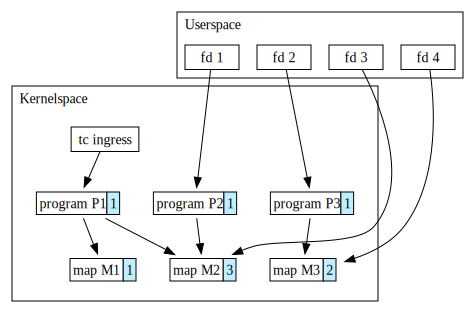
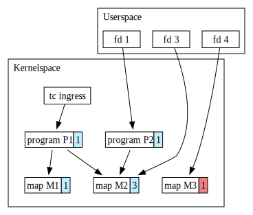
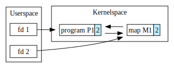
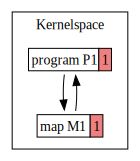

% BPF tailcalls (working title)

One of the things I work on is a firewall product that implements L3/L4
enforcement using BPF. The actual implementation is quite neat -- here's an
[old talk][0] for those interested. But for the purpose of this post, let's
just say that it's implemented using the [`tc` hook][1] and that care has been
taken to ensure that even if the userspace driver (a process) exits or crashes,
that packet classification and enforcement remains in place.

The premise of this post is that I received a bug report that enforcement was
failing during software upgrades. It took a few days, but I was eventually able
to reproduce the issue and managed to narrow the problem down to the driver
restarting. Basically, enforcement was temporarily failing while the driver was
down but recovered after the driver restarted and reconciled state.

Given that I had put in non-trivial effort to ensure this particular case was
handled, I was intrigued.

## The BPF object model

Before going further into the bug details, a quick primer on the BPF object
model is required. This section can be skipped if you're already familiar
with it.

At a high level, the BPF subsystem in the kernel uses reference counting to
manage object lifetimes, where objects include entities like programs, maps,
links, etc. These objects have inherent relationships (non-exhaustive):

* File descriptors may reference any object
* Programs may reference maps
* Multiple programs may reference the _same_ map
* Maps may contain (and thus reference) other maps
* Kernel hooks (not an object) may reference programs
* Links reference programs

Note that what I'm describing is closer to a mental model than an actual
specification. You'll see later the details get somewhat more complex.

To help illustrate the point, the following is a diagram that displays a
hypothetical (and nonsensical) networking application. Note that we omit links
to keep our discussion focused.

{ width=80% }

In the above, we see program `P1` attached to the traffic control ingress hook.
Every packet that enters `P1`'s network interface will have `P1` run against
it.

Reference relationships are drawn as directed arrows. Reference counts are
attached to each object and colored light blue.  For example, for `P1`, `M1`,
and `M2`:

1. `P1` has a reference count of 1 b/c the ingress hook is referencing it
1. `M1` has a reference count of 1 b/c `P1` is referencing it
1. `M2`, however, has a reference count of 3 b/c it has 3 entities referencing
   it

In this way, if a top level "owner" of an object goes away, the updates are
propagated down. For example, if `fd 2` were to go away, our system state would
look like the following:

{ width=60% }

Notice how `P3` is now missing and `M3`'s reference count has been updated to 1
(and highlighted red to denote this).

## The problem

Now back to the bug. Given that I had a reproducer, it was a relatively
straightforward matter of poking around and making some guesses.

The first place I checked were error counters -- all our BPF programs export
error counters b/c BPF is ahead-of-time compiled code. So it ranges from
difficult to impossible to introspect in production without them.

Immediately one counter stood out: failed tailcalls. Our program uses tailcalls
so both modularlize business logic and to help avoid verifier limits. Tailcalls
can be thought of as a function call, except instead of using an identifier at
the source-level, you have your program call into `bpf_tail_call(ctx, map,
idx)` , where `ctx` is the program context, `map` is an array map that holds
programs, and `idx` as the index for a program in `map` that execution should
jump to.

The program in question uses tailcalls completely statically in order to
organize code and avoid verifier limits, so failing tailcalls is quite
unexpected. Thus my first question: under what conditions does a tailcall fail?

To answer that, we look to the [documentation][7]:

> A call can fail if the destination program for the jump does not exist (i.e.
> *index* is superior to the number of entries in *prog_array_map*), or if the
> maximum number of tail calls has been reached for this chain of programs.

I know that we we aren't maxing out the tailcall limit b/c the program is
quite careful not to exceed it and there are plenty of integration tests
specifically exercising that logic. The maps are completely static after
attachment and should have reference counts held on them by the attached
program, so it also couldn't be the maps, or so I thought.

## Missing map entries

My first thought was that there was a bug with the tailcall machinery. I did
investigate for a bit but I didn't see any obvious errors. "Obvious" is the
operative word here b/c the x86-64 BPF-JIT code is eye-watteringly complex in
the wake of [Spectre][2] [mitigation][3] [mitigations][4].

In the interest of time (and possibly sanity), I put that theory aside to
explore some alternative avenues. Like checking on the state of the
`BPF_MAP_TYPE_PROG_ARRAY` map before and after the driver exits.

Lo and behold, confusion:

```shell
# bpftool map dump id 52
key: 00 00 00 00  value: 3b 01 00 00
key: 01 00 00 00  value: 3a 01 00 00
Found 2 elements

# pkill the-unamed-driver-process

# bpftool map dump id 52
Found 0 elements
```

The oddity is that under the BPF object model we described earlier, this
behavior is rather inexplicable. The first program in the tailcall chain is
still attached to the TC hook, so the map should not have been freed yet.  And
indeed, it is not -- it's just emptied.

This takes us to the `BPF_MAP_TYPE_PROG_ARRAY` implementation in
`kernel/bpf/arraymap.c`:

``` {#function .c .numberLines startFrom="1168"}
const struct bpf_map_ops prog_array_map_ops = {
	.map_alloc_check = fd_array_map_alloc_check,
	.map_alloc = prog_array_map_alloc,
	.map_free = prog_array_map_free,
	.map_poke_track = prog_array_map_poke_track,
	.map_poke_untrack = prog_array_map_poke_untrack,
	.map_poke_run = prog_array_map_poke_run,
	.map_get_next_key = array_map_get_next_key,
	.map_lookup_elem = fd_array_map_lookup_elem,
	.map_delete_elem = fd_array_map_delete_elem,
	.map_fd_get_ptr = prog_fd_array_get_ptr,
	.map_fd_put_ptr = prog_fd_array_put_ptr,
	.map_fd_sys_lookup_elem = prog_fd_array_sys_lookup_elem,
	.map_release_uref = prog_array_map_clear,
	.map_seq_show_elem = prog_array_map_seq_show_elem,
	.map_mem_usage = array_map_mem_usage,
	.map_btf_id = &array_map_btf_ids[0],
};
```

Immediately, `prog_array_map_clear` looks suspicious. Attaching to this
function using `bpftrace` and then killing the driver confirms it requires
further investigation:

```
$ sudo bpftrace -e 'kfunc:prog_array_map_clear { print(kstack) }'
Attaching 1 probe...

        bpf_prog_aac3249a5434cb33_prog_array_map_+52
        bpf_prog_aac3249a5434cb33_prog_array_map_+52
        dummy_init_module+52
        prog_array_map_clear+9
        bpf_map_release+45
        __fput+137
        task_work_run+93
        do_exit+887
        do_group_exit+49
        get_signal+2469
        arch_do_signal_or_restart+62
        exit_to_user_mode_prepare+389
        syscall_exit_to_user_mode+27
        do_syscall_64+108
        entry_SYSCALL_64_after_hwframe+114
```

It turns out that there is only a single place in the kernel that calls
`map_release_uref()`, in `kernel/bpf/syscall.c`:

``` {#function .c .numberLines startFrom="713"}
static void bpf_map_put_uref(struct bpf_map *map)
{
        if (atomic64_dec_and_test(&map->usercnt)) {
                if (map->ops->map_release_uref)
                        map->ops->map_release_uref(map);
        }
}
```

Blaming that code leads us to [`c9da161c6517 ("bpf: fix clearing on persistent
program array maps")`][5]. A reading of the commit message reveals to us this
behavior was intentionally added to avoid circular dependencies.

## Circular dependencies

The above commit elaborates:

> Having this flush independent of the refcount is for a reason: there can be
> arbitrary complex dependency chains among tail calls, also circular ones
> (direct or indirect, nesting limit determined during runtime), and we need to
> make sure that the map drops all references to eBPF programs it holds, so
> that the map's refcount can eventually drop to zero and initiate its freeing.
> Btw, a walk of the whole dependency graph would not be possible for various
> reasons, one being complexity and another one inconsistency, i.e. new
> programs can be added to parts of the graph at any time, so there's no
> guaranteed consistent state for the time of such a walk.

That takes us to the heart of the problem. In particular, it calls out the fact
that `BPF_MAP_TYPE_PROG_ARRAY` maps can be dynamically updated, even by BPF
programs!  Even though we don't use that ability, it still means the kernel
cannot generically shake out circular references with something like a "stop
the world" trace (as the kernel cannot pause execution without great damage
elsewhere).

**The bottom line is that no matter what the kernel reference count is on a
`BPF_MAP_TYPE_PROG_ARRAY` map, if all userspace references go away then the map
is cleared. This results in failed tailcalls b/c the map is empty.**

In case the above reasoning is a bit dense, consider the minimal degenerate
case:



Now when userspace goes away, you get:



which is a resource leak in the kernel. The kernel goes to great trouble to
avoid issues like these. Perhaps, as some might now think, at the expense of
ergonomics.

## Conclusion

If we take it at face value that the status quo is correct, what can we do
about our original bug? Fortunately, the solution is quite simple: pin the
`BPF_MAP_TYPE_PROG_ARRAY` map into [`bpffs`][6].

The only problem is it's not quite obvious that this is the only correct way to
use tailcalls, but it nonetheless is the reality we live in. This [isn't the
first time][8] this behavior was discovered and I'm sure it won't be the last.


[0]: https://www.youtube.com/watch?v=a3AwA1VdohU&t=12415s
[1]: https://www.man7.org/linux/man-pages/man8/tc-bpf.8.html
[2]: https://spectreattack.com/spectre.pdf
[3]: https://support.google.com/faqs/answer/7625886
[4]: https://github.com/torvalds/linux/commit/428d5df1fa4f28daf622c48dd
[5]: https://github.com/torvalds/linux/commit/c9da161c6517ba12154059d3b965c2cbaf16f90f
[6]: https://facebookmicrosites.github.io/bpf/blog/2018/08/31/object-lifetime.html#bpffs
[7]: https://github.com/torvalds/linux/blob/4853c74bd7ab7fdb83f319bd9ace8a08c031e9b6/include/uapi/linux/bpf.h#L1847-L1876
[8]: https://github.com/cilium/ebpf/blob/d1a52333f2c0fed085f8d742a5a3c164795d8492/collection.go#L320-L322
