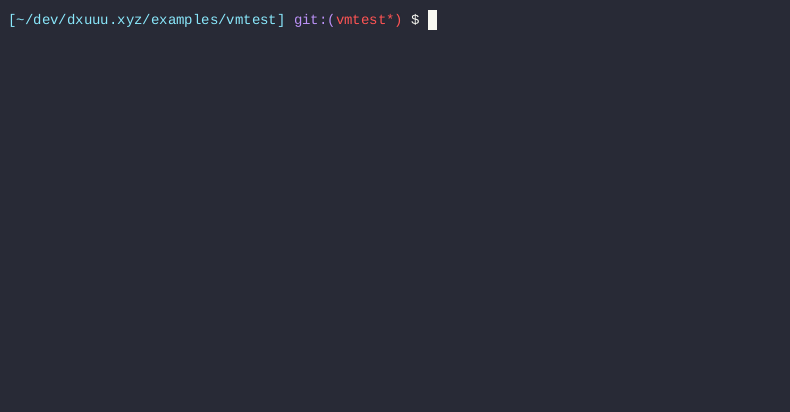

% vmtest: Run your tests in a virtual machine

## Motivation

Systems software that depends on specific kernel or host properties often
contains logic to gate functionality based on what features are available at
runtime. This necessarily begs the question: how do you test the platform
specific logic? Mocks can help, but they come with their own set of tradeoffs.
At the end of the day, there is no substitute for running your actual code.

eBPF (BPF) is somewhat of an extreme example of the above situation because of
how fast development occurs in that ecosystem. Most, if not all, BPF features
are built into the kernel, meaning that any application that makes heavy use of
BPF is heavily dependent on kernel version. Since I do quite a bit of
development on top of BPF, the rest of this post is rather BPF focused. Despite
that, keep in mind that all proposed techniques/solutions are quite general and
can be applied to other use cases.

## Background

Despite BPF being my motivation for `vmtest`, BPF paradoxically has excellent
support for testing in the form of [`BPF_PROG_RUN`][0].

BPF programs usually need to be attached to a hook. When the hook is reached
by the kernel, the proper program context is passed to the program and then
program execution occurs. `BPF_PROG_RUN`, on the other hand, allows you to run
your BPF programs in "freestanding" mode. More precisely, it allows userspace
to both provide the input context, run the program on demand, and collect the
program's return value (among a few other things).

Contrast this with something like `iptables` where it takes considerably more
setup (network namespaces, fake network devices, traffic generators, etc.) to
get automated tests. And even after all of that it's more of an integration
test than a true unit test.

Basically given `BPF_PROG_RUN`, all that's left to solve is how to control the
kernel your tests run on top of.

## Goals

The primary goal is to **create infrastructure that runs arbitrary code inside
precisely controlled kernels**. Along the way we may solve other problems or
enable other use cases, but our primary goal will help inform our design
decisions.

In addition, the following are design ideas (in decreasing order of importance)
that will help inform our decisions:

1. Make it reusable: `vmtest` should be as generic as possible and adoptable
   across many projects.
1. Make it work in CI: `vmtest` should be able to run in Github Actions.
   Supporting other providers would be even better.
1. Make it simple: defaults should "just work". Any configurables should be
   unavoidable to expose.

## Solution

Our solution is two-fold: [`vmtest`][1] and [`vmtest-action`][2].

`vmtest` is the workhourse binary and contains all the logic to orchestrate
`qemu` on the root host and `qemu-guest-agent` inside the guest VM. This
orchestration results in some neat results like being able to map the running
userspace into the guest VM as its rootfs. The end result is that your host's
userspace "just runs", except the kernel it's running under is different. The
binary also supports a handful of nice-to-have things such as a standard unix
interface, a terminal user interface, and support for multiple targets through
a configuration file.

`vmtest-action` is a Github Actions wrapper (ie. an [action][3]) that
downloads/installs `vmtest` and its runtime dependencies. The action exposes a
subset of the features `vmtest` supports but at the same time adds a few
conveniences (such as URL asset downloads) -- effectively tailoring `vmtest` to
CI usage.

The two part solution helps separate concerns but also allows for novel uses
cases such iterating on kernel changes using the `vmtest` binary.

## Multi-target example

Consider the following `vmtest.toml` configuration:

```
[[target]]
name = "check if kernel is 6.2"
kernel = "./bzImage-v6.2"
command = "/bin/bash -c 'uname -r | grep -e ^6.2.0$'"

[[target]]
name = "check if kernel is 6.1"
kernel = "./bzImage-v6.2"
command = "/bin/bash -c 'uname -r; uname -r | grep -e ^6.1.0$'"
```

The above has two targets: the first target checks if the running kernel is
v6.2 and the second checks if the running kernel is v6.1. Since they're both
going to run under a v6.2 kernel, only the first target should succeed.
Carefully note here that we do not define a rootfs or run install scripts to
get access to `bash` and `coreutils` -- the entire running userspace on your
host is shared into the VM.

This is what a run looks like:

{ width=100% }

Note that our second target fails as expected.

## CI example

Now pretend you have a bog standard Github Actions (GHA) workflow. It has
fairly standard steps -- for example installing dependencies, build
configuration, and executing a test runner. This workflow implicitly uses the
kernel the GHA runner's kernel. Perhaps it was new enough for a while but now
it's too old and you need to find a way to run your tests against a matrix of
newer kernels.

`vmtest-action` would satisfy your needs with the following diff:

```diff
diff --git a/.github/workflows/ci.yml b/.github/workflows/ci.yml
index 4b1d68f..d62fed9 100644
--- a/.github/workflows/ci.yml
+++ b/.github/workflows/ci.yml
@@ -7,6 +7,16 @@ on:
 
 jobs:
   build:
+    strategy:
+      matrix:
+        kernel:
+          - name: v6.0
+            url: https://github.com/danobi/vmtest/releases/download/test_assets/bzImage-v6.0
+          - name: v6.1
+            url: https://github.com/danobi/vmtest/releases/download/test_assets/bzImage-v6.1
+          - name: v6.2
+            url: https://github.com/danobi/vmtest/releases/download/test_assets/bzImage-v6.2
+
     runs-on: ubuntu-latest
     steps:
     - uses: actions/checkout@v3
@@ -21,5 +31,8 @@ jobs:
         ninja -C build
 
     - name: Run
-      run: |
-        ./build/vmtest-action-demo
+      uses: danobi/vmtest-action@master
+      with:
+        name: ${{ matrix.kernel.name }}
+        kernel_url: ${{ matrix.kernel.url }}
+        command: ${{ github.workspace}}/build/vmtest-action-demo
```

Note how the dependency install, configure, and build steps are being run
_outside_ the VM.

## Implementation

{ width=100% }

The first big idea is that vmtest tries to orchestrate everything through
QEMU's programmable interfaces, namely the QEMU machine protocol (QMP) for
orchestrating QEMU and qemu-guest-agent (which also uses QMP under the hood)
for running things inside the guest VM. Both interfaces use a unix domain
socket for transport.

Using QEMU's programmable interfaces is probably the only novel contribution we
make to this problem space. The other ideas are shamelessly borrowed from
earlier explorations of the virtual machine testing space. This contribution,
however, makes developing and extending `vmtest` a much saner and pleasant
experience over things like triple-escaping shell commands. qemu-guest-agent
alone gives us a clean out-of-band mechanism (so not requiring networking or
SSH) to run commands inside the guest.

The second big idea is that we use 9p filesystems to share host filesystem
inside the guest. This is useful so that vmtest targets can import/export data
in bulk without having to specify what to copy. In a kernel target, vmtest
exports two volumes: `/mnt/vmtest` and the root filesystem. The latter export
effectively gives the guest VM the same userspace environment as the host,
except we mount it read-only so the guest cannot do too much damage to the
host.


[0]: https://github.com/torvalds/linux/blob/16a8829130ca22666ac6236178a6233208d425c3/include/uapi/linux/bpf.h#L332-L368
[1]: https://github.com/danobi/vmtest
[2]: https://github.com/danobi/vmtest-action
[3]: https://docs.github.com/en/actions/creating-actions/about-custom-actions
